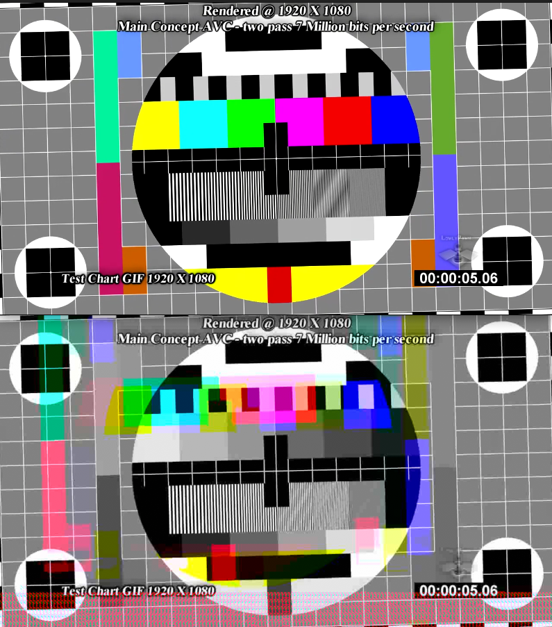

Buffer Alignment
---

If you are tryign to save a YUV image produced from SDL to Ffmpeg and your output image has misaligned colors like this:



then you have aligned ffmpeg buffers to 32 bits and the SDL buffers are un-aligned (packed).

Fix this by moving the frame's data pointers

```rs
fn fill_frame_with_memcpy(frame: &mut ffi::AVFrame, buffer: *const u8, len: usize, i: i64) {
    unsafe {
        let bfslice: &[u8] = &*slice_from_raw_parts(buffer, len);
        let frameslice: &mut [u8] = &mut *slice_from_raw_parts_mut((*frame.buf[0]).data, len);
        let cyslice: &mut [u8] = &mut *slice_from_raw_parts_mut(frame.data[2], 1024);
        frameslice.copy_from_slice(bfslice);

        // frame data is 32 bit aligned
        // sdl buffers are un-aligned (packed)
        let offset0: usize = frame.linesize[0] as usize * frame.height as usize;
        let offset1: usize = offset0 + (frame.linesize[1] as usize * (frame.height as usize / 2));
        frame.data[1] = frame.data[0].offset(offset0 as isize);
        frame.data[2] = frame.data[0].offset(offset1 as isize);
 
    }
}
```
